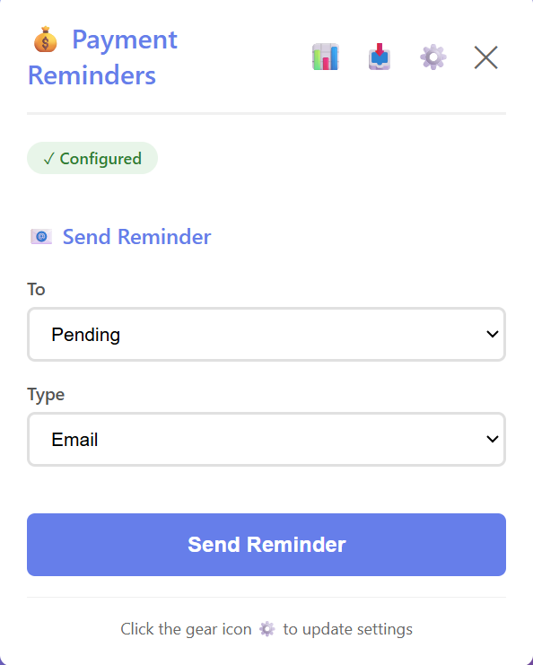

<p align="center">
  
</p>

# Pingo — Sheet-Native Payment Automation using n8n

> Automate payment reminders, follow-ups, and report generation directly from Google Sheets — powered by n8n.

---

## Table of Contents

- [Overview](#overview)
- [Key Features](#key-features)
- [How It Works](#how-it-works)
- [Architecture](#architecture)
- [Tech Stack](#tech-stack)
- [Installation](#installation)
- [n8n Workflow Setup](#n8n-workflow-setup)
- [Usage](#usage)
- [Example Use Cases](#example-use-cases)
- [Security](#security)
- [Future Improvements](#future-improvements)
- [Why n8n?](#why-n8n)

---

## Overview

Small businesses often track invoices in Google Sheets but manually send reminders — which is slow, error-prone, and inefficient.

**Pingo** solves this by connecting Google Sheets to [n8n](https://n8n.io/), enabling automated communication, logging, and reporting with a single click through a Chrome Extension.

<p align="center">
  
</p>

---

## Key Features

- 📧 Send automated **Email** and **WhatsApp** payment reminders directly from Google Sheets
- ⚙️ Powered by **n8n workflows** for message automation, logging, and orchestration
- 🤖 AI-generated and customizable message templates
- 📊 Automated financial report generation with charts and summaries
- 🔐 Secure OAuth-based access and encrypted data handling

---

## How It Works

```
1. User opens Google Sheet containing invoice data
2. Chrome Extension reads sheet data securely
3. User clicks "Send Reminder" or "Send WhatsApp Message"
4. Extension sends data to n8n webhook
5. n8n handles the rest automatically
```

**n8n Automation Engine handles:**
- Message generation
- Email delivery
- WhatsApp delivery
- Logging and tracking
- Report generation

---

## Architecture

```
Google Sheets
      │
      ▼
Chrome Extension
      │
      ▼
n8n Webhook (Automation Engine)
      │
      ├── Email Service (SMTP / Gmail API)
      ├── WhatsApp API
      ├── Report Generator
      └── Logging Database / Sheet
```

---

## Tech Stack

| Layer | Technology |
|---|---|
| **Frontend** | Chrome Extension (JavaScript, HTML, CSS) |
| **Automation** | n8n (Workflow automation engine) |
| **APIs** | n8n Webhooks, Gmail API / SMTP, WhatsApp API |
| **Data** | Google Sheets API |
| **Security** | OAuth 2.0, Encrypted data transfer |

---

## Installation

### 1. Clone Repository

```bash
git clone https://github.com/hahaanisha/Pingo.git
cd pingo
```

### 2. Load Chrome Extension

1. Open Chrome and navigate to `chrome://extensions`
2. Enable **Developer Mode** (top-right toggle)
3. Click **"Load unpacked"**
4. Select the project folder

### 3. Set Up n8n

1. Install and launch n8n (see [n8n Workflow Setup](#n8n-workflow-setup) below)
2. Import the provided workflow JSON files
3. Copy the generated webhook URL into the extension config file

---

## n8n Workflow Setup

The `n8n/` folder in this repository contains pre-built workflow JSON files that you can import directly into n8n — no need to build the automation from scratch.

### Step 1 — Launch n8n

Run n8n locally using npx:

```bash
npx n8n
```

Then open your browser and go to `http://localhost:5678`.

> Alternatively, use [n8n Cloud](https://n8n.io/) for a hosted instance.

### Step 2 — Import the Workflow JSON

1. In the n8n dashboard, click **"New Workflow"**
2. Click the **≡ menu icon** (top-right of the canvas)
3. Select **"Import from File"**
4. Navigate and select the relevant `.json` file (here it is : N8N Agents):
5. Click **"Import"** — the full workflow canvas will load automatically

### Step 3 — Configure Credentials

After importing, update the following nodes with your own credentials:

- **Gmail / SMTP node** → Add your Google account or SMTP details under `Credentials → Gmail OAuth2`
- **WhatsApp node** → Enter your WhatsApp Business id and auth token
- **Google Sheets node** → Connect your Google account via OAuth and select your target sheet

> 💡 Go to **Settings → Credentials** in n8n to manage all saved credentials in one place.

### Step 5 — Activate the Workflow

1. Toggle the workflow status from **Inactive → Active** using the switch in the top-right of the n8n canvas
2. The webhook is now live and ready to receive triggers from the Pingo extension

> ⚠️ Workflows must be set to **Active** to respond to incoming webhook calls. Inactive workflows will silently ignore all requests.

---

## Usage

1. Open your invoice Google Sheet
2. Launch the **Pingo** Chrome Extension
3. Choose an action:
   - 📧 Send Email Reminder
   - 💬 Send WhatsApp Reminder
   - 🙏 Send Thank You Message
   - 📊 Generate Report
4. n8n automatically processes and delivers the messages

---

## Example Use Cases

| Use Case | Description |
|---|---|
| **Payment Reminders** | Automatically remind clients about pending invoices |
| **Thank You Messages** | Send acknowledgements immediately after payment |
| **Bulk Greetings** | Send festive or seasonal messages to all customers |
| **Monthly Reports** | Auto-generate revenue summaries with charts |

---

## Security

- 🔑 OAuth-based Google authentication
- 🔒 Encrypted communication between extension and n8n
- 🚫 No permanent storage of sensitive sheet data
- ✅ User-controlled permissions

---

## Future Improvements

- [ ] Dashboard analytics
- [ ] Scheduled automatic reminders
- [ ] Invoice PDF attachments
- [ ] Multi-sheet support
- [ ] Business insights using AI

---

## Why n8n?

n8n serves as the **automation backbone** of Pingo, providing:

| Capability | Benefit |
|---|---|
| Workflow orchestration | Chain multiple actions in one trigger |
| Message routing | Deliver via Email or WhatsApp intelligently |
| Automation logic | Conditional flows based on payment status |
| Logging & tracking | Auto-update sheets with delivery status |
| Report generation | Produce formatted financial summaries |

This architecture makes Pingo **scalable**, **flexible**, and **fully automated** without requiring a dedicated backend server.

---

## License

This project is licensed under the [MIT License](LICENSE).

---

<p align="center">Built with ❤️ to simplify payment workflows for small businesses</p>
